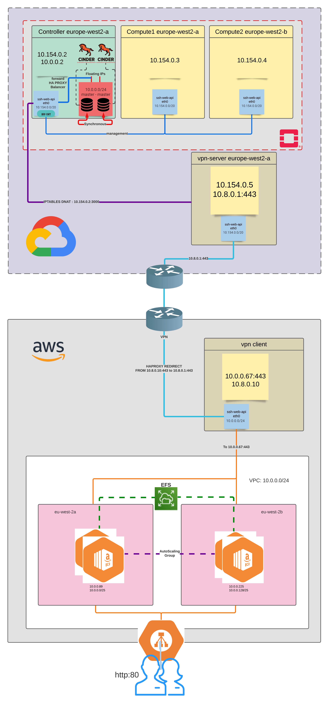
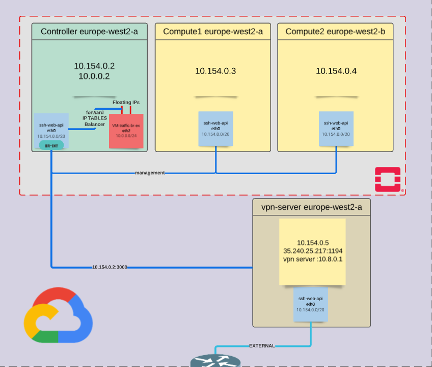
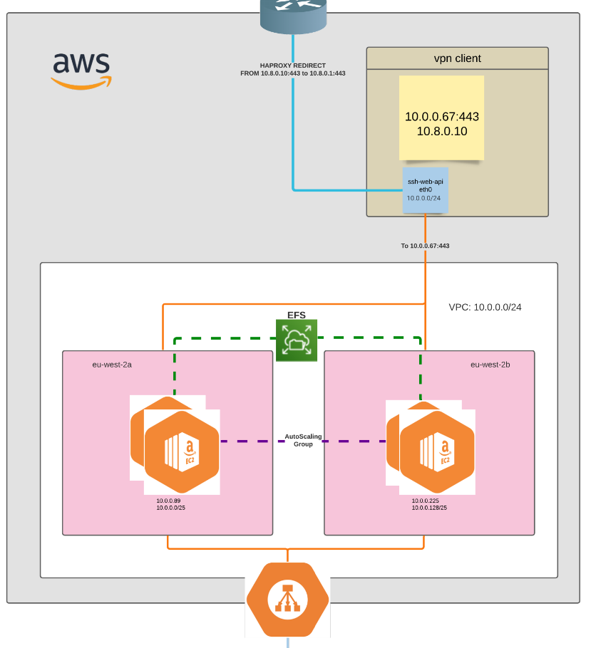

# Tutorial to setup a multinode private cloud with openstack

[toc]

# Full Project Schema




## Install openstack packstack multinode

### Network view

|        *networks*         | Controller/Network | Compute-1  | Compute-2  |
| :-----------------------: | :----------------: | :--------: | :--------: |
| ***management (br-int)*** |     10.154.0.2     | 10.154.0.3 | 10.154.0.4 |
|  ***external (br-ex)***   |      10.0.0.2      |     /      |     /      |

### Schema



### Installation

#### Prepare the VMs

On each node : 

```sh
#!/bin/sh

setenforce 0; 
systemctl stop NetworkManager firewalld; 
systemctl disable NetworkManager firewalld; 
yum update -y; 
sudo reboot;
```

On each node :

- go to `/etc/hosts`
- copy dns lines on each node to have each time the 3 nodes hostnames : 

```txt
# /etc/hosts

...

10.154.0.2  controller.europe-west2-a.c.arcl-306615.internal controller 
10.154.0.3 compute-1.europe-west2-a.c.arcl-306615.internal compute-1  
10.154.0.4 compute-2.europe-west2-b.c.arcl-306615.internal compute-2 


```

On each node  in the file `/etc/ssh/sshd_config`, find those lines and change them by : 

```sh
PermitRootLogin yes
PasswordAuthentication yes

# After exiting :
systemctl restart sshd
```

 On **Controller** node :

```sh
# change root passwd
sudo su -
passwd
# create ssh key
ssh-keygen
cat /root/.ssh/id_rsa.pub

# copy the content and put it inside /root/.ssh/authorized_keys in compute nodes
# or add the ssh public key directly via GCP
```

#### Packstack install on controller node

```sh
yum install -y https://www.rdoproject.org/repos/rdo-release.rpm; 
yum install -y https://repos.fedorapeople.org/repos/openstack/openstack-rocky/rdo-release-rocky-2.noarch.rpm
yum install -y openstack-packstack;
# launch install with packstack given file
packstack --answer-file answer.txt
```

In the file `/etc/sysconfig/network-scripts/ifcfg-br-ex` generated, add your controller address :

```sh
IPADDR=10.0.0.2 #eth1 address
NETMASK=255.255.255.0 # eth1 netmask
GATEWAY=10.0.0.1 # eth1 gateway
```

Then : 

```sh
systemctl restart network
## give the addr of eth1 to br-ex after each reboot of the controller
ifdown eth1
ifdown br-ex 
ifup br-ex
ifup eth1
```


### Problems / Solutions

#### Facter -p error during installation

An error could be raised during the install because of facter -p, then you must execute inside of each node `yum install -y leatherman; yum downgrade leatherman`


#### If your internal and external ip are not the same

```sh
curl ifconfig.me
# will give you your external ip, ex : 34.105.150.202
vim /etc/httpd/conf.d/15-horizon-vhosts.conf
# Replace the URL in ServerAlias line with the one given by curl
systemctl restart httpd
```


#### Create public network on openstack linked with br-ex

```sh
openstack network create --share --external \
						 --provider-physical-network provider \
						 --provider-network-type flat public;
openstack subnet create --no-dhcp --network public \
						--allocation-pool start=10.0.0.10,end=10.0.0.250 \
						--dns-nameserver 8.8.8.8 --gateway 10.0.0.2 \
						--subnet-range 10.0.0.0/24 provider
```

> In your config file answer.txt : your must put `provider:br-ex` for OVS_BRIDGE_MAPPING_IFACES 

#### Magic Lines if external ips don't work 

```sh
#!/bin/sh
systemctl start neutron-l3-agent
ifdown eth1
ifdown br-ex
ifup br-ex
ifup eth1
```

#### Can ping but not ssh my VMs with br-ex

The public and private networks should have the same MTUs (1400 is good)

```sh
openstack network set --mtu <mtu value> <network id >
```

#### My instances can't reach external world

On your controller :

- List firewall rules `iptables -L --line-number`
- if there are rules which reject flows, then use `iptables -D <chain_name> <rule_number>` to delete them
  - Exemple : `iptables -D INPUT 32`
- execute this line `echo 1 > /proc/sys/net/ipv4/ip_forward`

#### Save iptables config

> Save iptable config by using `service iptables save`

#### Debug interface flows

> Use `tcpdump -i <iface> imcp`


#### My eth1 does not have connectivity

Redirect flows to eth0 with iptables to simulate it :

```sh
iptables -t nat -A POSTROUTING -o eth0 -j MASQUERADE
```


#### Redirect flows comming in a port into VMs :

```sh
iptables -t nat -A PREROUTING -p tcp --dport 3000 -j DNAT --to-destination 10.0.0.109:3306;


iptables -t nat -A POSTROUTING -j MASQUERADE 
# ou plus good practice :
iptables -t nat -A POSTROUTING -p tcp -d 10.0.0.109 --dport 3306 -j SNAT --to-source 10.154.0.2:3000
```


#### Restart a VM when compute host is up

https://docs.ukcloud.com/articles/openstack/ostack-how-recover-instance.html


## Create database Myql cluster replication Master Master

### Installation of mysql-server 

> We will work on Fedora VMs : 
>
> - Master1 : 10.0.0.109
> - Master2 : 10.0.0.159

Source [here](https://docs.fedoraproject.org/en-US/quick-docs/installing-mysql-mariadb/)

On each instance : 

```sh
# Install packages
sudo dnf install https://repo.mysql.com//mysql80-community-release-fc31-1.noarch.rpm
sudo dnf install mysql-community-server

# Start Service
sudo systemctl start mysqld
sudo systemctl enable mysqld

# find Default Password
sudo grep 'temporary password' /var/log/mysqld.log

# Configure mysql before the first use 
sudo mysql_secure_installation

# connect to it
sudo mysql -u root -p


# To remove mysql 
sudo rpm -e --nodeps mysql-community-libs mysql-community-common mysql-community-server
```

 

### Setting up Master to master replication

#### Prepare Master1

On **Master1**, add to `/etc/my.cnf` under [mysqld]:

```sh
server-id=1
log-bin=mysql-bin
max_connections=10000
```

Restart mysqld with :

```sh
systemctl restart mysqld
```

Open mysql command line with `mysql -u root -p` :

```mysql
CREATE USER 'repl'@'%' IDENTIFIED WITH mysql_native_password BY "Admin123#";
GRANT REPLICATION SLAVE ON *.* to 'repl'@'%';
FLUSH PRIVILEGES;
SHOW MASTER STATUS\G; # File=mysql-bin.000001 Position=458
```

#### Dump DB of Master1 into Master2 and prepare Master2

On **Master1** :

```sh
mysqldump -p mysql > mysql.sql #create a file where all master db & user is saved
scp mysql.sql 10.0.0.159:/root/ #create and add pub key of master1 to master2 if needed
```

On **Master2** : 

- add to `/etc/my.cnf` under [mysqld]:

```sh
server-id=2
max_connections=10000
```

- Restart mysqld services :

```sh
systemctl restart mysqld
```

- Copy the db of **Master1** in **Master2** to add the same replicate user:

```sh
mysql -p mysql < mysql.sql
```

> To do a master master replication, we must do a master slave with **master1 as master** and another master slave with **master2 as master**

#### Master1 as master

On **Master2** , open mysql and :

```mysql
CHANGE MASTER TO 
	master_host="10.0.0.109", 
	master_user="replicator",
	master_password="Admin123#",
	master_log_file="mysql-bin.000013",
	master_log_pos=3645;
START SLAVE; 
# if doesn't work, STOP IT AND START IT with
# stop slave;
# reset slave;
# start slave;
```

> `master_log_file` and `master_log_pos` can be found [here](####Prepare Master1) and `master_host` is the Master1 address

Verify if the Master1 is connected with `show processlist;` or `show slave status\G;`

On **Master1**, verify the established connection with :

```sh
netstat -natp | egrep -i established.*mysql
# yum install net-tools bind-utils; 
```

#### Master2 as master

On **Master2** : 

- add to `/etc/my.cnf` under [mysqld]:

```sh
server-id=2 ## already added
log-bin=mysql-bin
```

- Restart mysqld services :

```sh
systemctl restart mysqld
```

- Open mysql and get the master status

```mysql
SHOW MASTER STATUS\G; # File=mysql-bin.000002 Position=757
```

On **Master1**:

```mysql
CHANGE MASTER TO 
	master_host="10.0.0.159", 
	master_user="replicator",
	master_password="Admin123#",
	master_log_file="mysql-bin.000019",
	master_log_pos=546;
START SLAVE; 
# if doesn't work, STOP IT AND START IT with
# stop slave;
# reset slave;
# start slave;
```

> `master_log_file` and `master_log_pos` can be found [here](####Prepare Master2) and `master_host` is the Master2 address

Verify if the Master2 is connected with `show processlist;` or `show slave status\G;`

### Issues

#### [Error 1062](https://serverfault.com/questions/336888/what-causes-the-mysql-error-1062-duplicate-entry-when-starting-slave) : Master Master Broken

Detailed explanation here : https://serverfault.com/questions/459400/mysql-master-master-broken

## Create MariaDB Galera cluster Master Master replication

### Configuration

| **Name**    | master1   | master2    |
| ----------- | --------- | ---------- |
| **Address** | 10.0.0.18 | 10.0.0.150 |
| **OS**      | centos7   | centos7    |

### Disable Selinux and Firewalld on both nodes

```sh
sudo systemctl stop firewalld
sudo systemctl disable firewalld
sudo setenforce 0
vim /etc/selinux/config ## setenforce=disabled
reboot
```

### Install repositories on both nodes

```sh
sudo yum remove mariadb-libs -y
sudo echo "
[mariadb]
name = MariaDB
baseurl = http://yum.mariadb.org/10.0/centos7-amd64
gpgkey=https://yum.mariadb.org/RPM-GPG-KEY-MariaDB
gpgcheck=1
" > /etc/yum.repos.d/cluster.repo
sudo yum install socat
sudo yum install MariaDB-Galera-server MariaDB-client rsync galera
```

### mysql_secure_installation

```sh
sudo systemctl start mysql
sudo mysql_secure_installation
sudo systemctl stop mysql 
```

### Config file on both nodes

```sh
sudo vim /etc/my.cnf.d/server.cnf ## put under mariadb-10.0
[mariadb-10.0]
binlog_format=ROW
default-storage-engine=innodb
innodb_autoinc_lock_mode=2
innodb_locks_unsafe_for_binlog=1
query_cache_size=0
query_cache_type=0
bind-address=0.0.0.0
datadir=/var/lib/mysql
innodb_log_file_size=100M
innodb_file_per_table
innodb_flush_log_at_trx_commit=2
wsrep_provider=/usr/lib64/galera/libgalera_smm.so
wsrep_cluster_address="gcomm://10.0.0.18,10.0.0.150" 
wsrep_cluster_name='galera_cluster'
wsrep_node_address='10.0.0.18'  # replace by 10.0.0.150 for master-2
wsrep_node_name='master-1' 		# replace by master-2 for master-2
wsrep_sst_method=rsync
wsrep_sst_auth=db_user:admin

```

## Launch cluster config on master-1

```sh
sudo /etc/init.d/mysql start --wsrep-new-cluster
```

## Launch mysql on master-2

```sh
sudo systemctl start mysql
```


## **Create a LoadBalancer with [HAproxy](https://devops.ionos.com/tutorials/install-and-configure-haproxy-load-balancer-on-ubuntu-1604/#:~:text=The%20HAProxy%20main%20configuration%20file,%2Fhaproxy%2Fhaproxy.cfg%20.&text=The%20global%20section%20contains%20settings,all%20of%20the%20proxies%20settings.) for [mysql](https://www.digitalocean.com/community/tutorials/how-to-use-haproxy-to-set-up-mysql-load-balancing-3)**

### **Installation of haproxy**

- **install HAproxy :**

```sh
yum -y install haproxy
systemctl enable haproxy

# ps SHOW VARIABLES LIKE 'validate_password%';
```


### **Preparing master and slave VMs** 

| **Controller (haproxy host)** | **My-sql-master-1** | **My-sql-master-2** |
| :---------------------------: | :-----------------: | :-----------------: |
|       **10.0.0.2:3000**       | **10.0.0.109:3306** | **10.0.0.159:3306** |

- **On both Masters, create a user haproxy_check without password** 

```mysql
create user 'haproxy_check'@'10.0.0.2'; 
FLUSH PRIVILEGES;
```

- **If it does not respect the password policy, you should change the policy by adding into `/etc/my.cnf` under [mysqld]**

  - ```sh
    validate_password.policy=LOW
    validate_password.length=0
    validate_password.mixed_case_count=0
    validate_password.number_count=0
    validate_password.special_char_count=0
    max_connections=10000 # this is in order to not block the db in case of invalid password
    ```

  - **restart mysqld**

    ```sh
    systemctl restart mysqld
    ```

    

> **you can see if it works by entering in your controller : `mysql -h 10.0.0.109 -u haproxy_check -p -e "SHOW DATABASES"`**


### **Configuring HA proxy**

**Delete everything in the configuration file `/etc/haproxy/haproxy.cfg`  and replace it by :**

- **find more informations about the defaults and global fields [here](https://www.digitalocean.com/community/tutorials/how-to-use-haproxy-to-set-up-http-load-balancing-on-an-ubuntu-vps)**  
- **Unlike HTTP load balancing HAProxy doesn’t have a specific “mode” for MySQL so we use tcp.**

```sh
global
    log 127.0.0.1 local0 notice
    user haproxy
    group haproxy

defaults
    log global
    retries 2
    timeout connect 3000
    timeout server 5000
    timeout client 5000

#---------------------------------------------------------------------
# Load Balancing system for my_sql and my_sql back openstack
# instances at 10.0.0.109 and 10.0.0.159
#---------------------------------------------------------------------

listen my_load_balancer
    bind 10.154.0.2:3000 # listening address
    mode tcp			 # for mysql
    option mysql-check user haproxy_check # specify the user created previously
    default-server fastinter 1000 # the default check interval is 2000ms
    balance roundrobin # alternate between hosts up, alternatives : lessconn
    server my_sql_first 10.0.0.109:3306 check # sql addresses
    server my_sql_back  10.0.0.159:3306 check # sql addresses


#---------------------------------------------------------------------
# Load Balancing logs used to check the haproxy logs if you want :)
#---------------------------------------------------------------------
#listen 0.0.0.0:9090
#    mode http
#    stats enable
#    stats uri /
#    stats realm Strictly\ Private
#    stats auth A_Username:Akram
#    stats auth Another_User:AkramBis


```

### **Restart and Go :)**

- **After editing `/etc/haproxy/haproxy.cfg`, restart the `haproxy` service for the changes to take effect:**

```sh
systemctl restart haproxy
```

- **You can also check if your configuration is valid by using :**

```sh
haproxy -f /etc/haproxy/haproxy.cfg
```


# **VPN Tunneling**

> **Tutorial [here](https://www.digitalocean.com/community/tutorials/how-to-set-up-an-openvpn-server-on-ubuntu-18-04-fr)**

## **Conditions préalables :**

**Avoir 3 machines sur Ubuntu avec un user nommé vpn, qui a les droits root**

```bash
adduser vpn
usermod -aG sudo vpn
```


**Durant tout le tutoriel, il sera considéré que le user est en permanence vpn, quelle que soit la machine.**

**Une de ces machines sera appelée tout au long du tuto "server" une autre, "client", et enfin la dernière "certificate authority" (CA)**
 **\- Le server doit se trouver sur le même sous-réseau que les machines du cloud privé (pour nous, sur GCP, dans le sous-réseau 10.154.0.0/24)**
 **\- Le client doit se trouver sur le même sous-réseau que les machines du cloud publique (pour nous, sur AWS, dans le sous-réseau 10.0.0.0/24)**
 **\- La CA peut être à peu près n’importe où, mais il reste plus facile et logique qu’elle soit sur le même sous-réseau que le server**

**Il faudra beaucoup switch entre les différentes machines. Pour faciliter la lecture, le nom de la machine sera marqué en gras avant chaque switch ou début d’étape.**

**Le server doit pouvoir se connecter en ssh aux machines CA et client.**
 **Pour cela, utilisez la commande suivante sur la machine server**

```bash
ssh-keygen
```

**Les fichiers ~/.ssh/id_rsa et ~/.ssh/id_rsa.pub sont alors générés.**
 **Copiez le contenu du fichier ~/.ssh/id_rsa.pub**
 **Allez sur la machine pour faire la même commande CA**

```bash
ssh-keygen
```

**Les mêmes fichiers sont générés. Ajoutez le fichier authorized_keys et collez la clef publique du server, préalablement copiée.**

```bash
emacs ~/.ssh/authorized_keys
```

**Enregistrez et fermez le fichier une fois cela fait.**

**Copiez ensuite la clef publique de la CA et collez là dans le fichier authorized_keys du server.**

**Effectuez la même opération d’échange des clefs entre le server et le client.**

**Pour tester si tout fonctionne, on essaie de se connecter en ssh depuis le server.**

```bash
ssh vpn@ClientIp
exit
ssh vpn@CAIp
exit
```


## **Etape 1 : Installation d'OpenVPN et d'EasyRSA**

**Commençons par l’installation d’openvn côté server**

```bash
sudo apt update
sudo apt install openvpn
```

**Openvpn fonctionne grâce à un chiffrage des données. Il nous faut donc une autorité qui puisse nous donner des certificats de confiance.**
**Bref, autant la build nous-même.**

**Installons donc EasyRsa sur les machines server et CA**

```bash
wget -P ~/ https://github.com/OpenVPN/easy-rsa/releases/download/v3.0.4/EasyRSA-3.0.4.tgz
cd ~/
tar xvf EasyRSA-3.0.4.tgz
```

**La version 3.0.4 n’est potentiellement pas la dernière. Consultez la page https://github.com/OpenVPN/easy-rsa/releases afin de prendre la version qui vous convient.**


 ## **Etape 2 : Configuration d’EasyRsa et le la CA**

**Nous allons configurer EasyRsa sur la CA en premier**

```bash
cd ~/EasyRSA-3.0.4/
cp vars.example vars
emacs vars
```

**Trouvez les lignes :**

```bash
#set_var EASYRSA_REQ_COUNTRY  "US"
#set_var EASYRSA_REQ_PROVINCE  "California"
#set_var EASYRSA_REQ_CITY    "San Francisco"
#set_var EASYRSA_REQ_ORG    "Copyleft Certificate Co"
#set_var EASYRSA_REQ_EMAIL   "me@example.net"
#set_var EASYRSA_REQ_OU     "My Organizational Unit"
```

**Et les décommenter (vous pouvez mettre des valeurs appropriées dans les champs, cela ne change rien à la suite, ici, je laisse les valeurs par défaut pour le tuto) :**

```bash
set_var EASYRSA_REQ_COUNTRY  "US"
set_var EASYRSA_REQ_PROVINCE  "California"
set_var EASYRSA_REQ_CITY    "San Francisco"
set_var EASYRSA_REQ_ORG    "Copyleft Certificate Co"
set_var EASYRSA_REQ_EMAIL   "me@example.net"
set_var EASYRSA_REQ_OU     "My Organizational Unit"
```

**Cela fait, enregistrez et quittez le fichier.**

**On va maintenant pouvoir lancer le script d’initialisation**

```bash
./easyrsa init-pki
```

**Output:**

```text
init-pki complete; you may now create a CA or requests.

Your newly created PKI dir is: /home/vpn/EasyRSA-3.0.4/pki
```

**Puis build**

```bash
./easyrsa build-ca nopass
```

**Dans la sortie, il vous sera demandé de confirmer le nom commun ou common name de votre CA :**

**Output:**

```text
Common Name (eg: your user, host, or server name) [Easy-RSA CA]:
```

**On peut y mettre ce que l’on veut, mais ici, on va simplement appuyer sur entrée pour valider le nom par défaut.**

**On a maintenant une CA.**

**** 

## **Étape 3 : Création du certificat, de la clé et des fichiers de chiffrement du serveur**

**Maintenant que l’on a une CA, il est temps de s’en servir.**

**Retournons sur le server pour initialiser EasyRsa**

```bash
cd ~/EasyRSA-3.0.4/
./easyrsa init-pki
```

**Puis, on utilise l’option gen-req, suivie du nom de la machine, ici, on choisit "server"**

```bash
 ./easyrsa gen-req server nopass
```

 **Une clef privée est alors créée, ainsi qu’un fichier server.req, contenant une demande de certificat.**

**Le but va maintenant être de faire signer ce certificat par la CA, puis, de le reprendre.**

```bash
sudo cp ~/EasyRSA-3.0.4/pki/private/server.key /etc/openvpn/
scp ~/EasyRSA-3.0.4/pki/reqs/server.req vpn@your_CA_ip:/tmp
```

**Le fichier est maintenant dans le dossier tmp de la CA. Allons sur la CA pour y signer le certificat et le renvoyer**

```bash
cd ~/ EasyRSA-3.0.4/
./easyrsa import-req /tmp/server.req server
./easyrsa sign-req server server
```

**Dans la sortie, il vous sera demandé de vérifier que la demande provient d'une source fiable. Tapez yes puis enter pour confirmer :**

```text
You are about to sign the following certificate.
Please check over the details shown below for accuracy. Note that this request
has not been cryptographically verified. Please be sure it came from a trusted
source or that you have verified the request checksum with the sender.
 
Request subject, to be signed as a server certificate for 3650 days:
 

subject=
  commonName        = server

Type the word 'yes' to continue, or any other input to abort.
Confirm request details: yes
```

**** 

**Il faut ensuite retransférer le certificat signé**

```bash
scp pki/issued/server.crt vpn@your_server_ip:/tmp
scp pki/ca.crt vpn@your_server_ip:/tmp
```

**De retour sur le server, il reste à créer la clef.**

**L’opération peut prendre quelques minutes, c’est normal.**

```bash
sudo cp /tmp/{server.crt,ca.crt} /etc/openvpn/
cd ~/EasyRSA-3.0.4/
./easyrsa gen-dh
openvpn --genkey --secret ta.key
sudo cp ~/EasyRSA-3.0.4/ta.key /etc/openvpn/
sudo cp ~/EasyRSA-3.0.4/pki/dh.pem /etc/openvpn/
```

**Normalement, à cette étape, la configuration des certificats est terminée. On peut passer à la création de paires de clef pour communiquer avec le client.**

**** 

## **Etape 4 : Création d'une paire certificat/clé client**

**Sur le server, nous allons créer une paire, puis l’envoyer à la CA pour qu’elle la signe**

```bash
mkdir -p ~/client-configs/keys
chmod -R 700 ~/client-configs
cd ~/EasyRSA-3.0.4/
./easyrsa gen-req client1 nopass
cp pki/private/client1.key ~/client-configs/keys/
scp pki/reqs/client1.req vpn@your_CA_ip:/tmp
```

**Une fois sur la machine CA, on signe donc, puis on renvoie le fichier.**

```bash
cd EasyRSA-3.0.4/
./easyrsa import-req /tmp/client1.req client1
./easyrsa sign-req client client1
```

**Output:**

```text
Type the word 'yes' to continue, or any other input to abort.
Confirm request details: yes
```

```bash
scp pki/issued/client1.crt vpn@your_server_ip:/tmp
```

**De retour sur le server, on récupère le fichier**

```bash
cp /tmp/client1.crt ~/client-configs/keys/
cp ~/EasyRSA-3.0.4/ta.key ~/client-configs/keys/
sudo cp /etc/openvpn/ca.crt ~/client-configs/keys/
```

## **Étape 5 : Configuration du service OpenVPN**

**Toujours sur le server, commençons la configuration du service ovpn**

```bash
sudo cp /usr/share/doc/openvpn/examples/sample-config-files/server.conf.gz /etc/openvpn/
sudo gzip -d /etc/openvpn/server.conf.gz
sudo emacs /etc/openvpn/server.conf
```

**trouvez la ligne suivante**

```text
tls-auth ta.key 0 # This file is secret
```

**Cette ligne devrait déjà être décommentée, mais si elle ne l’est pas, enlevez le ';' devant afin de la décommenter.**

**Même chose avec la ligne**

```text
cipher AES-256-CBC
```

**Juste après cette ligne, ajoutez**

```text
auth SHA256
```

**Trouvez ensuite la ligne commençant par "dh". Si nécessaire, modifiez le nom de fichier indiqué ici en supprimant le 2048 afin qu'il s'aligne sur la clé que vous avez générée à l'étape précédente.**

```text
dh dh.pem
```

**Enfin, décommentez les lignes**

```text
user nobody
group nogroup
```

**en enlevant le ';' au début de chaque ligne.**

**Le fichier de configuration est opérationnel à ce moment.**
**Toutefois, il est encore possible de le personnaliser un peu.**

**Nous avons choisi de changer le protocole udp en tcp.**
**Changez les lignes**

```text
proto udp
port 1194
explicit-exit-notify 1
```

**pour les lignes**

```text
proto tcp
port 443
explicit-exit-notify 0
```

**Vous pouvez enregistrer et fermer le fichier.**

**** 

## **Étape 6 : Ajustement de la configuration réseau du serveur**

**Toujours sur la machine server**

```bash
sudo emacs /etc/sysctl.conf
```

**décommentez la ligne**

```text
net.ipv4.ip_forward=1
```

**en enlevant le '#' en début de ligne.**

**Enregistrez et fermez le fichier.** 
**Puis lancez le pour prendre en compte les modifications ajoutées.**

```bash
sudo sysctl -p
```

**L'output devrait contenir**

```text
net.ipv4.ip_forward = 1
```

**Lancez la commande**

```bash
ip route | grep default
```

**L’output doit être de la forme**

```text
default via 203.0.113.1 dev interface_name proto static
```

**Retenez l'interface_name.**
**Nous allons maintenant utiliser ufw pour rediriger le trafic**

```bash
sudo apt install ufw
sudo ufw allow 22/tcp
sudo ufw allow 443/tcp
```

**ouvrez le fichier before rules**

```bash
sudo emacs /etc/ufw/before.rules
```

**En haut du fichier, ajoutez les lignes mises en évidence ci-dessous**

 ```text
#
# rules.before
#
# Rules that should be run before the ufw command line added rules. Custom
# rules should be added to one of these chains:
#  ufw-before-input
#  ufw-before-output
#  ufw-before-forward
#

#################################### START OPENVPN RULES ###################################
# NAT table rules
*nat
:POSTROUTING ACCEPT [0:0]
# Allow traffic from OpenVPN client to interface_name (change to the interface you discovered!)
-A POSTROUTING -s 10.8.0.0/8 -o interface_name -j MASQUERADE
COMMIT
##################################### END OPENVPN RULES ####################################
 
# Don't delete these required lines, otherwise there will be errors
*filter
. . .
 ```

**Enregistrez et fermez le fichier, puis, ouvrez le fichier**

```bash
sudo emacs /etc/default/ufw
```

**À l'intérieur, trouvez la directive** 

```text
DEFAULT_FORWARD_POLICY DROP
```

**et changez la valeur de "DROP" à "ACCEPT"**

```text
DEFAULT_FORWARD_POLICY="ACCEPT"
```

**Enregistrez et fermez le fichier, puis, redémarrez ufw.**

```bash
sudo ufw disable
sudo ufw enable
```

**La configuration réseau devrait à présent être suffisante pour gérer le trafic d’OpenVPN.**

## **Étape 7 - Démarrage et activation du service OpenVPN**

**Nous pouvons enfin démarrer le service OpenVPN du server**

```bash
sudo systemctl start openvpn@server
sudo systemctl status openvpn@server
```

**l’output devrait mentionner**

```text
active (running)
```

**La ligne suivante permet de démarrer le service au démarrage de la machine**

```bash
sudo systemctl enable openvpn@server
```

**** 

## **Étape 8 - Création de l'infrastructure de configuration du client**

**Toujours sur le server**

```bash
mkdir -p ~/client-configs/files
cp /usr/share/doc/openvpn/examples/sample-config-files/client.conf ~/client-configs/base.conf
emacs ~/client-configs/base.conf
```

**Changez l’adresse et le port de votre server**

```text
#The hostname/IP and port of the server.
# You can have multiple remote entries
# to load balance between the servers.
remote your_server_ip 443
changez le protocole de udp à tcp
proto tcp
```

**Ensuite, décommentez les directives user et group en supprimant le ';' au début de chaque ligne :**

```text
# Downgrade privileges after initialization (non-Windows only)
user nobody
group nogroup
```

**Trouvez les directives qui fixent ca, cert et key. Commentez ces directives, car vous ajouterez bientôt les certificats et les clés dans le dossier lui-même**

```text
#ca ca.crt
#cert client.crt
#key client.key
```

**De même, commentez la directive tls-auth, car vous ajouterez ca.key directement dans le fichier de configuration du client**

```text
#tls-auth ta.key 1
```

**Les lignes cipher et auth doivent avoir les mêmes paramètres que dans le fichier /etc/openvpn/server.conf**

```text
cipher AES-256-CBC
auth SHA256
```

**ajoutez les lignes suivantes à la fin du fichier, suivies d’un retour à la ligne.**

```text
key-direction 1
script-security 2
up /etc/openvpn/update-resolv-conf
down /etc/openvpn/update-resolv-conf

```

**Enregistrez et fermez le fichier.**

**Créez le fichier**

```bash
emacs ~/client-configs/make_config.sh
```

**ajoutez les lignes suivantes**

```bash
#!/bin/bash
 
# First argument: Client identifier
 
KEY_DIR=~/client-configs/keys
OUTPUT_DIR=~/client-configs/files
BASE_CONFIG=~/client-configs/base.conf
 
cat ${BASE_CONFIG} \
  <(echo -e '<ca>') \
  ${KEY_DIR}/ca.crt \
  <(echo -e '</ca>\n<cert>') \
  ${KEY_DIR}/${1}.crt \
  <(echo -e '</cert>\n<key>') \
  ${KEY_DIR}/${1}.key \
  <(echo -e '</key>\n<tls-auth>') \
  ${KEY_DIR}/ta.key \
  <(echo -e '</tls-auth>') \
  \> ${OUTPUT_DIR}/${1}.ovpn
```

**Enregistrez et fermez le fichier, puis, marquez le en tant exécutable :**

```bash
chmod 700 ~/client-configs/make_config.sh
```

## **Étape 9 - Création de configurations du client**

**Toujours sur le server**

```bash
cd ~/client-configs
sudo ./make_config.sh client1
ls ~/client-configs/files
```

**Output:**

```text
client1.ovpn
```

**Ensuite, il faut envoyer ce fichier de configuration au client.**

```bash
scp ~/client-configs/files/client1.ovpn vpn@your_client_ip:/tmp
```

## **Étape 10 - Installation de la configuration client**

**Maintenant, il faut se rendre sur la machine client, à laquelle on vient d'exporter le fichier de conf.**

```bash
sudo cp /tpm/client1.ovpn ~/client1.ovpn
sudo apt update
sudo apt install openvpn
sudo yum install epel-release
sudo yum install openvpn
ls /etc/openvpn
```

**Output:**

```text
update-resolv-conf
```

**lancez la commande**

```bash
sudo openvpn --config client1.ovpn --daemon
```

**La connexion est maintenant établie. Les deux machines devraient être sur le même sous-réseau 10.8.0.0/24**
**Pour tester, lancez la commande**

```bash
ping 10.8.0.1
```

**On devrait obtenir des réponses de la part du server.**

## **Steps to launch it after reboot**

- **vpn client (aws) :**

```sh
sudo systemctl start openvpn
sudo openvpn --config client2.ovpn --daemon

```

- **vpn server (gcp) :**

```sh
  sudo su - vpn
  sudo iptables-restore < iptables.save # /!\ une fois la connexion etablie /!\
```

- **vpn Client(aws):**

  ```shell
  sudo systemctl restart haproxy  # /!\ une fois ip-tables forward /!\
  ```

  

# **AWS : High Availability public Cloud**

## **Schema**

****


## **Configure a Load Balancer**

**Service: EC2>Load Balancing>Load Balancers**

1. **Configure Load Balancer**
   1. **Click on Create Load Balancer**
   2. **Click on Application Load Balancer**
   3. **Set its name** 
   4. **in Availability Zone select your VPC and your 2 Subnets both in DIFFERENT Availability Zone**
   5. **Click next**
2. **Configure Security Settings** 
   1. **Click next (there's a security warning telling us we don't use https, this is normal)**
3. **Configure Security Groups**
   1. **click on select an existing security group**
   2. **select the previously created  security group**
4. **Configure Routing**
   1. **Select New target group**
   2. **Set a Name**
   3. **Target type = instance, http, port 80**
   4. **Click on advanced health check settings if you want to change them (Optional)**
5. **Register Target**
   1. **Click on next (the target will be set when we will create the AutoScaling Group)**
6. **Click on Create**

## **Create an Auto Scaling group**

**Service: EC2>Auto Scaling>Launch Configuration**

### **Create a launch configuration**

- **Set a Name**

- **Select your VM image in AMI (ubuntu-with-wp-configured)**

- **Select your instance type (t2.micro for free tier)**

- **Click on Advanced details and select assign a public IP to all instances  you can also enter you installation script into the user data.**

  ``````
  #!/bin/bash
  
  sudo sed -i -e "s/34.89.33.35:3306/IP-VPN-client:443/g" /var/www/html/wp-config.php
  sudo sed -i -e "s/define( 'WP_DEBUG', false );/define( \'WP_DEBUG\', false );\ndefine( \'WP_HOME\',\'http:\/\/ELB-DNS-ADRESS\/\' );\ndefine( \'WP_SITEURL\', \'http:\/\/ELB-DNS-ADRESS\/\' );/g" /var/www/html/wp-config.php
  
  
  sudo systemctl stop apache2
  sudo systemctl start apache2
  ``````

  

- **Select an existing security group and select the previously created security group** 

- **Select an existing key pair, then select your key**

### **Create an Auto Scaling group**

**Service: EC2>Auto Scaling>Auto Scaling group** 

- **Click on Change to a launch configuration and select the launch configuration**
- **Select your VPC and its subnets click next**
- **attach to an existing load balancer and Select the security group**
- **state verification tick ELB and set the period to 30s if you want faster health check for testing** 
- **select the number of instances 2,2,2 with no stategy, click next until you create an ASG**

##  **EFS for Stateless Virtual Machines**

****

# **Wordpress Install**

## **Install php & mariadb**

```sh
sudo apt update
sudo apt install apache2 php libapache2-mod-php mariadb-server php-mysql unzip
sudo a2enmod rewrite
```


## **wordpress.conf for apache**

```sh
sudo vim /etc/apache2/sites-available/wordpress.conf
```

**And write inside** 

```html
<VirtualHost *:80>
        ServerName wordpress.localhost
        DocumentRoot /var/www/wordpress
        <Directory /var/www/wordpress>
                AllowOverride all
                Require all granted
        </Directory>
        ErrorLog /var/log/apache2/error.wordpress.log
        CustomLog /var/log/apache2/access.wordpress.log combined
</VirtualHost>
```

**And then** 

```sh
sudo a2ensite wordpress
sudo systemctl reload apache2
```


## **wordpress install**


```sh
wget https://fr.wordpress.org/wordpress-latest-fr_FR.zip
sudo unzip wordpress-latest-fr_FR.zip -d /var/www
sudo chown www-data:www-data /var/www/wordpress -R
sudo chmod -R 777 /var/www/wordpress
```


## **db configuration**

**Open mysql and** 

```mariadb
create database wordpress;
create user 'wordpress'@'%' identified by 'Admin123#';
GRANT ALL PRIVILEGES ON wordpress.* TO 'wordpress'@'localhost';
FLUSH PRIVILEGES;
QUIT;
```


## **Edit wp_config.php**

**Give DB informations and it will work !**

```sh
define('WP_HOME','http://<public-ip>');
define('WP_SITEURL','http://<public-ip>');
```


